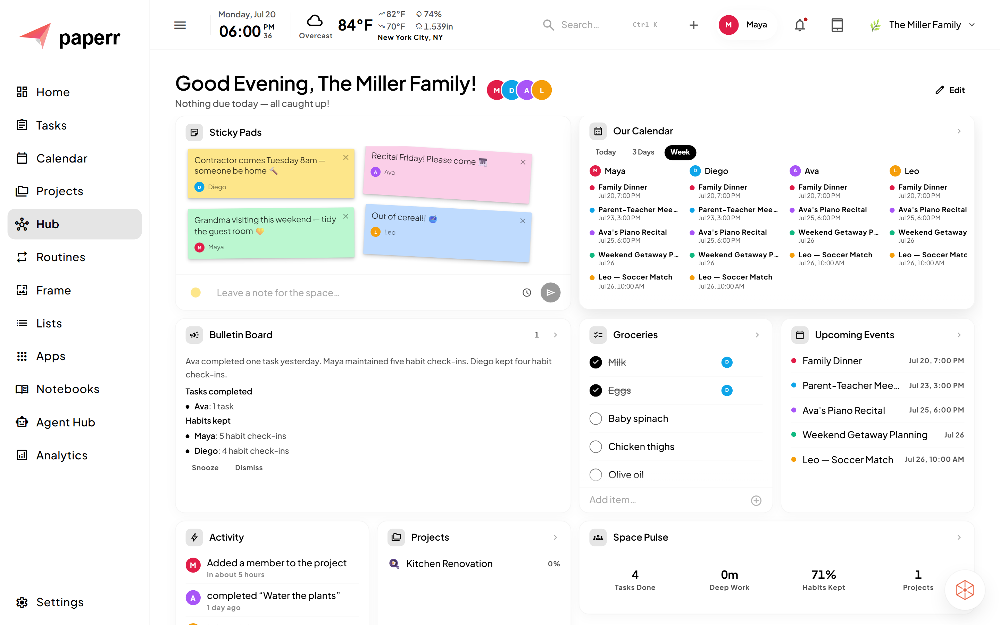

<div align="center">


### Organize everything. Share nothing.

**paperr** is a private, self-hosted operating system for your household or team — tasks, projects, calendar, notes, routines, focus tools, a shared wall dashboard, and a built-in AI assistant, all running on your own network. Nothing ever leaves your LAN.

**100% free. Your data never leaves your network. A tiny but powerful AI that runs on your machine.**

<p>
  
  
  
  
  
</p>

<p>
  <a href="#-quick-start"><b>Quick Start</b></a> ·
  <a href="#-features"><b>Features</b></a> ·
  <a href="#-meet-dotai-your-ai-assistant"><b>dotAi</b></a> ·
  <a href="#-three-modes-one-app"><b>Modes</b></a> ·
  <a href="#-tech-stack"><b>Tech Stack</b></a> ·
  <a href="#-contributing"><b>Contributing</b></a>
</p>

</div>

---

## Why paperr?

A calendar app answers one question: *what's on today?* Real life is bigger than that. You've got tasks to assign, projects to run, groceries to remember, house docs to keep, habits to hold, and a family or team to keep in sync — and most tools make you rent a different cloud subscription for each one, hand over your data to do it, and lose it all the moment the internet drops.

**paperr replaces the whole stack with one app you host yourself — and it costs nothing.**

- 🆓 **Free** — no subscription, no AI credits caps, no "pro" tier. Clone it, run it, done.
- 🔒 **Truly private** — runs on a machine you own; data lives in SQLite files on your machine. No accounts you don't control, no telemetry, no cloud. It never leaves your walls.
- 🤖 **Local, private AI** — dotAi runs on paperr's **bundled AI server** (based on LiteRT): a small, efficient **Gemma E2B** model that installs itself on `npm install` and runs on **CPU alone, under 2GB of RAM** — the laptop or Mac you already have, no GPU or special hardware needed. It auto-offloads from memory when idle, so it costs you nothing while you're not using it. Or bring your own Ollama / LM Studio. Your tasks and projects are read and edited by a model on **your** hardware — nothing is sent to anyone else's servers unless you deliberately point it at a cloud provider.
- 🗓️ **Not just a digital calendar** — tasks, projects, lists, notebooks, routines, focus & wellness apps, a photo Frame, and a shared Hub, all in one place and all talking to each other.
- 🏠 **Built for a household _or_ a team** — create **Spaces** (Family or Team) with their own members, areas, and data.
- 🌐 **One install for the whole family or team** — set paperr up once on a single machine on your network, and everyone signs in from their own phone, laptop, or tablet — no per-device install, no per-person subscription.
- 📺 **Turn a spare tablet into a shared screen** — an old iPad, Fire tablet, or Android slate becomes a wall-mounted, always-on dashboard for the whole family or team — Home board widgets, Frame photos, and Hub, always visible.
- 📱 **Every screen, one app** — a polished desktop layout, a touch-first phone experience, and a wall-mountable tablet dashboard.
- ⚡ **Real-time everything** — changes sync instantly across every device via Socket.io.
- 🧠 **Built to reduce friction for every kind of brain** — calm, one-thing-at-a-time defaults that genuinely help if you have ADHD, are autistic, or just run low on executive fuel. [More below](#-built-to-reduce-friction--for-every-kind-of-brain).

---

## 📸 Screenshots

<div align="center">

  | Hub |
  | :---: |
  |  |

  | Every screen |
  | :---: |
  |  |

</div>


---

## ✨ Features

### 🗂️ Spaces & accounts

Organize life into separate **Spaces** — a *Family* space for home, a *Team* space for work. Each space gets its own members, predefined **Areas** (Kitchen, Garage, Office… or Development, Design, Marketing…), and fully isolated, private-by-default data.

<details>
<summary>More on Spaces & accounts</summary>

Self-service **registration** (with optional quick-login PIN and avatar) and a **Browse Spaces** screen let people discover and request to join a space, with admin approval. Notebooks, Projects, Lists, and Custom Agents are **private to their creator by default**, with a one-tap toggle to share them with the whole space. Space admins can permanently delete a space (type-to-confirm) from the Edit Space screen. New spaces end with an optional "Set up your apps" step to enable the bundled AI server and add curated Frame photo and Good Thoughts collections. Every new space is seeded with type-appropriate starter lists, a starter routine, and a "Welcome to Paperr" onboarding project that tours the app.

</details>

### ✅ Tasks

The heart of paperr. Create, assign, schedule, and complete tasks with:

- Sub-tasks, tags, comments, and file attachments
- A markdown notes scratchpad per task
- Due dates *and* explicit start/end time blocks that show up on the Calendar
- Recurrence, including specific weekdays
- **Today** and **Overdue** smart views, assignment across household/team members, drag-and-drop organization and bulk actions
- A little confetti/emoji/toast celebration when a task or habit gets completed — tune individual effects down or off in Settings → Motion

### 🎯 Deep Work Mode

Pick a task, go fullscreen, and get nothing else until you're done. A distraction-free Pomodoro/count-up timer runs alongside the full task detail and its sub-tasks, with a "still working?" check-in every 15 minutes and session time logged per task — plus a shared widget showing who on your team is heads-down right now.

### 📝 Lists

Lightweight checklist-style lists with custom icons and an emoji picker — groceries, packing lists, honey-do lists. Items can optionally link to full tasks or projects.

### 📊 Projects

Full project management for the bigger stuff — home renovations, trips, work initiatives:

- **Board**, **List**, and **Phases** views (a step tracker with per-phase progress)
- Phases can hold named **Milestones**, both manually markable complete
- A **Watch** toggle so members get notified when a watched project's tasks complete or get blocked
- Per-project members and a filtered activity feed

### 📅 Calendar

A real calendar with **Day / Week / Month / Agenda** views, events with attendees, habit time-of-day dividers and per-day habit rings alongside tasks, a mini month picker, quick-add box, per-day weather, and an "up next" rail.

### 📓 Notebooks (Knowledge Base)

An Obsidian-style knowledge base — organize **Notebooks** of full **markdown notes**. Recipes, manuals, meeting notes, house docs — a shared brain for your space.

### 🔁 Routines

Time-anchored habits that auto-reset daily, inspired by the "biological arc" idea:

- **Protocols** — goal buckets (Morning Optimization, Sleep, Fitness…)
- **Day Arc** — a chronological timeline of the day's habits
- **Progress** — streaks and per-protocol stats

### 🧘 Focus & Wellness Apps

A built-in suite of focus tools on the **Apps** page — **Pomodoro**, **Stopwatch**, **Timer**, guided **Breathe**, **Meditate**, **Ambient Sound**, a flip-clock **Clock** with alarms, and **Good Thoughts** (cycling affirmations/quotes/mantras you author yourself). Run them full-screen or pin any of them to your Home board.

### 💭 Good Thoughts — a good thought to inspire

Build your own collections of affirmations, quotes, or mantras — custom color, icon, category, and any text you write yourself, not just presets. Each collection can be **time-bound** (morning, afternoon, evening…) so the right thought shows up at the right part of the day.

<details>
<summary>More on Good Thoughts</summary>

Cycle them in a dashboard widget, or interleave them as text cards into Frame's fullscreen photo slideshow. New spaces can also add a curated starter collection (e.g. Stoic Quotes) in one click from the Apps setup step instead of starting empty.

</details>

### 🖼️ Frame — beautiful art to relax between productive sessions

Turn any screen into a digital photo frame. **Add the photos you actually want** — family pictures, vacation shots, whatever you upload — auto-downscaled and stored server-side so they sync to every device on your network, then play fullscreen with configurable transitions.

<details>
<summary>More on Frame</summary>

Prefer not to upload your own? Start from a hand-curated collection of public domain art imported in the background instead — either way, a calm, ad-free way to fill an old tablet or spare monitor between focus sessions.

</details>

### 🧩 Home Board & Hub — smart AI widgets that help you get things done

A customizable, swipable **widget board** — add the widgets that matter (tasks, calendar, weather, projects, routines, activity, focus timers, Good Thoughts, Time Progress) and arrange your perfect home screen. The **AI Agent** widget surfaces live insights from any agent of your choice right on the board, so dotAi's proactive suggestions are one glance away instead of a page visit. A separate shared **Hub** board gives the whole space a collaborative landing page with Sticky Pads (corkboard notes), a per-member calendar, a shared list, and everyone's routines side-by-side.

### 🔔 Notifications & Activity

A personal notification feed (project comments, task completions/blocks on things you watch) in the header bell, alongside a real-time activity feed of everything happening across the space.

### 💾 Backups

Trigger a manual database snapshot or schedule automatic backups (daily/weekly/monthly with configurable retention) from Settings, with one-click restore (auto-snapshotting first) and delete.

---

## 🤖 Meet dotAi, your AI assistant

Chat with dotAi anytime from the slide-out drawer to create, edit, and query tasks, projects, events, and more. Don't love a reply? Hit regenerate for another take, and flip between every alternate response with the arrow buttons underneath it.

### 🌅 Proactive Agents & Agent Hub

Beyond chat, paperr runs **background agents** — on a schedule, via `node-cron` — that surface helpful, dismissable insight cards on a dedicated **Agent Hub** page:

| Agent                        | What it does                                                          |
| ---------------------------- | --------------------------------------------------------------------- |
| **Morning Brief**      | A short daily summary of today's tasks, overdue items, and events     |
| **Reschedule Advisor** | Spots overdue tasks and proposes smart new dates — one tap to accept |
| **Priority Focus**     | Surfaces what matters most on a stacked day                           |
| **Workload Spread**    | Flags overloaded upcoming days and proposes redistributing tasks      |
| **Bulletin Board**     | A space-wide daily/weekly digest of completed tasks and habits        |

Cards are calm by design — no popups or spam. Dismiss, snooze, or approve with a tap. Anything an agent proposes (rescheduling, completing, creating a task) is queued for approval, never applied automatically. Every pre-built agent also has a **Run Now** button on the Agent Hub page to trigger it on demand instead of waiting for its schedule.

You can also build your own **Custom Agents** — a name, a schedule, and free-text instructions — which run the same tool-calling loop and can be tested live before saving.

---

## 🧠 Built to reduce friction — for every kind of brain

paperr isn't designed *only for* neurodivergent users, but a lot of what makes it calm makes it genuinely easier to live with if you have ADHD, are autistic, or just run low on executive fuel — so it can support the neurodivergent members of your family or team, right alongside everyone else:

- **One thing at a time** — Deep Work Mode goes fullscreen on a single task, with a Pomodoro/count-up timer and a gentle "still working?" nudge. No tab, no feed, no next thing.
- **The app decides what's next, not you** — Today/Overdue views and the Morning Brief and Priority Focus agents surface what matters, so a stacked day doesn't start with a blank-page decision.
- **Falling behind isn't a wall** — the Reschedule Advisor proposes new dates for overdue tasks with one tap. Nothing is auto-applied; every agent suggestion waits for your yes.
- **Calm by default** — dismissable insight cards, no popups, no red-badge anxiety.
- **Structure you can lean on** — Routines auto-reset daily and lay the day out on a Day Arc, so the scaffolding is there without you rebuilding it each morning.
- **Reusable named timers** — save "Chicken Defrost", "Leave in 10", "Laundry" once and reuse them — small help for time-blindness.
- **Regulation tools built in** — guided Breathe (box / 4-7-8 / calm), Meditate, and Ambient Sound on the Apps page, each with an optional before/after mood check so you can *see* a session helped.
- **A shared brain** — Notebooks and Lists hold what working memory drops.
- **Motion-sensitive by choice, not by default** — animation (confetti, weather icons, widget jiggle, alarm shake, breathing pulse) can overwhelm rather than delight if you're sensitive to on-screen motion. A master Reduce Motion switch in Settings turns it all off at once, defaults on if your OS already asks for reduced motion, with per-effect toggles if you just want to kill one thing.

---

## 📱 Three modes, one app

paperr automatically adapts to whatever device opens it — no separate apps to install.

| 🖥️ Desktop                                                                       | 📱 Phone                                                                       | 📺 Tablet                                                                                                                              |
| ---------------------------------------------------------------------------------- | ------------------------------------------------------------------------------ | -------------------------------------------------------------------------------------------------------------------------------------- |
| Sidebar navigation, dense multi-column layouts, and a slide-out dotAi chat drawer. | Bottom-nav, touch-first shell built around the customizable widget Home board. | The full app in a touch-optimized nav-rail shell — a wall-mountable dashboard for the kitchen or office, sized for a mounted display. |

The mode is auto-detected from screen size and touch support on first load, remembered from then on, and can be switched anytime from an in-app button (e.g. the desktop-icon button in the tablet header).

> 💡 **Give an old tablet a second life.** Since paperr just runs in a browser on your LAN, any tablet you already own — an old iPad, a Fire tablet, an Android slate — can be propped up or mounted as an always-on shared screen for the whole family or team, no app install required.

---

## 🚀 Quick Start

### Prerequisites

- **Node.js 22.5+** (the server uses the built-in `node:sqlite` module, which needs 22.5 or later)
- *(Optional)* **Python 3** — lets `npm install` auto-provision paperr's own [bundled AI server](#why-paperr). Skipped safely if Python isn't found; add it later and re-run `npm install` in `server/` to enable it.
- *(Optional)* **Ollama** or **LM Studio** — external local LLM providers, if you'd rather point dotAi at one of those instead of the bundled server

### Install & run (development)

```bash
git clone https://github.com/biswasprateek/paperr.git
cd paperr
npm run install:all      # installs root + server + client dependencies, creates server/.env
npm run dev              # starts API (:3000) and client (:5173) together
```

> 🔐 `npm run install:all` creates `server/.env` from `.env.example` (if it doesn't already exist) and auto-generates real random values for `JWT_SECRET` / `JWT_REFRESH_SECRET` — no manual copy/paste step needed. It never overwrites secrets you've already set. To (re-)run just that step: `npm run setup:env`.

> 🤖 **Bundled AI Server, installs itself:** `npm run install:all` (which runs `npm install` inside `server/`) automatically provisions paperr's own local AI model via `litert-lm` — see [Why paperr](#why-paperr) for what it runs on. It looks for a Python interpreter on your machine to build a project-local virtual environment (`server/ai/litert/venv`):
>
> | Platform | Looks for                    |
> | -------- | ---------------------------- |
> | Windows  | `py -3`, then `python`   |
> | macOS    | `python3`, then `python` |
> | Linux    | `python3`, then `python` |
>
> If no Python interpreter is found, this step is skipped with a warning and the rest of the install continues normally — install Python 3 and re-run `npm install` in `server/` to enable it later, or use Ollama/LM Studio instead (see Configuration below). Once installed, manage the server (start/stop, live memory usage, auto-offload when idle, model picker, downloading additional models) from **Settings → paperr AI Server**.

On first launch, the **Setup Wizard** walks you through creating your first space and admin account.

> 🌱 **Want it pre-populated instead?** `node scripts/seed-demo.cjs` creates a fully-populated demo space ("The Miller Family", 4 members, realistic tasks/projects/notes/routines across every section) — log in as any of them with password `paperrdemo1` (maya is admin). Re-running it wipes and recreates just that demo space.

### Production (recommended for everyday use)

**Windows:**

```powershell
./start-paperr.ps1            # builds the client, then serves everything on :3000
./start-paperr.ps1 -NoBuild   # skip rebuild if the client is already current
```

**macOS / Linux:**

```bash
./start-paperr.sh
```

**Any platform:**

```bash
npm run build   # bundles the React app
npm start       # Express serves the API + app on port 3000
```

Then open **`http://<your-machine-ip>:3000`** from any device on your network.

### 🧪 One-click installers (experimental)

> **Experimental — not the supported path yet.** Verified end to end on Windows and Linux; macOS is untested. If anything goes sideways, use the steps above, which remain the recommended way to install and run paperr.

For non-technical users, one downloadable file does the whole thing:

| OS      | File                                                            | First run                                            |
| ------- | --------------------------------------------------------------- | ---------------------------------------------------- |
| Windows | [`install/paperr-windows.cmd`](install/paperr-windows.cmd)   | SmartScreen may warn — **More info → Run anyway** |
| macOS   | [`install/paperr-macos.command`](install/paperr-macos.command) | `chmod +x` it, then right-click → **Open**        |
| Linux   | [`install/paperr-linux.sh`](install/paperr-linux.sh)         | `chmod +x` it                                        |

**Nothing to install first.** The file checks for **Node 22.5+**, **git**, and **Python 3** (for the bundled AI server, which never blocks the install), lists whatever's missing, and installs it for you after a keypress — winget on Windows, Homebrew on macOS, apt/dnf/zypper/pacman on Linux — falling back to download links where none of those exist. It then confirms once before a first install, clones paperr to `~/paperr` (`%USERPROFILE%\paperr` on Windows), installs dependencies, generates `server/.env`, builds the client, starts the server on `:3000`, and opens the app. Every run after that just starts it.

**Everyday use:** the installer adds a desktop shortcut plus an app-menu entry (Start Menu / `~/Applications/paperr.app` / `.desktop`). Clicking it starts the server if it isn't already running, then opens paperr in a chromeless Chrome/Edge window — an app window with its own icon and taskbar entry. No Electron, no bundled browser, nothing installed system-wide, and **no code signing on any platform** — which is exactly why Windows shows the SmartScreen prompt the first time. Without a Chromium-family browser it falls back to a normal tab in your default one.

From an existing checkout, `npm run app` does the same thing (`npm run app -- --dev` for the dev servers).

On macOS without Chrome/Edge/Brave installed, Safari has no `--app` equivalent, so paperr opens as a normal tab — use Safari's **File → Add to Dock** (macOS 14+) for a real app window, or install a Chromium-based browser.

**Uninstalling:** double-click `install/uninstall-windows.cmd` / `uninstall-macos.command` / `uninstall-linux.sh`, which names the folder it's about to remove, then asks whether to delete your data and defaults to keeping it. Windows also lists paperr in **Settings → Installed apps**. From a terminal it's `npm run uninstall` in the install folder, plus `-- --purge` to delete the database, uploads and backups as well.

A dev checkout and a one-click install use the same shortcut names, so each only ever touches the entries it created — launching one won't repoint the other's shortcuts, and uninstalling one won't strip them.

Full detail, including the failure modes: [`install/README.md`](install/README.md).

---

## 🌐 Network access

paperr binds to `0.0.0.0`, so it's reachable from every device on your LAN. Find your local IP (`ipconfig` on Windows, `ifconfig`/`ip a` on Linux/macOS) and open:

```
http://192.168.x.x:3000
```

> 💡 **Tip:** Set a static IP or DHCP reservation for the host machine so the URL never changes, and add a desktop/taskbar shortcut to `start-paperr.ps1` for one-click launch.

---

## ⚙️ Configuration

`server/.env` is created automatically by `npm run install:all` (see Quick Start above), with `JWT_SECRET` / `JWT_REFRESH_SECRET` auto-generated. Edit `server/.env` directly to adjust anything else:

| Variable               | Default                        | Description                      |
| ---------------------- | ------------------------------ | -------------------------------- |
| `PORT`               | `3000`                       | Server port                      |
| `JWT_SECRET`         | *(auto-generated)*           | Signs access tokens              |
| `JWT_REFRESH_SECRET` | *(auto-generated)*           | Signs refresh tokens             |
| `DB_PATH`            | `./data/databases/paperr.db` | SQLite database file path        |
| `UPLOADS_PATH`       | `./uploads`                  | File attachment storage          |
| `LLM_BASE_URL`       | `http://localhost:11434`     | Ollama / LM Studio base URL      |
| `LLM_MODEL`          | `llama3`                     | Local model name for dotAi       |
| `HTTPS_ENABLED`      | `false`                      | Enable TLS on the LAN (optional) |

---

## 🔐 Security

paperr is built private-first, with real auth baked in:

- **JWT** access + refresh tokens stored in HTTP-only cookies
- **bcrypt**-hashed passwords (`bcryptjs`) and quick-login **PINs**
- **Brute-force protection** — accounts lock after repeated failed attempts
- **Role-based access** — admin vs. member, enforced server-side
- **Session management** and a full **audit log** of sensitive actions

---

## 🧱 Tech Stack

| Layer                                    | Technology                                                                                                                                                     |
| ---------------------------------------- | -------------------------------------------------------------------------------------------------------------------------------------------------------------- |
| **Runtime**                        | Node.js 22.5+ (needs the built-in`node:sqlite` module)                                                                                                       |
| **API**                            | Express.js                                                                                                                                                     |
| **Database**                       | SQLite via Node's built-in`node:sqlite` (single file, zero config, no native build step)                                                                     |
| **Auth**                           | JWT (HTTP-only cookies) + bcrypt (`bcryptjs`)                                                                                                                |
| **Real-time**                      | Socket.io                                                                                                                                                      |
| **Scheduling**                     | `node-cron` (backups, proactive AI agents)                                                                                                                   |
| **Frontend**                       | React 18 + Vite + React Router v6                                                                                                                              |
| **State**                          | Zustand + React Query                                                                                                                                          |
| **Styling**                        | Tailwind CSS                                                                                                                                                   |
| **Editors / Charts / DnD / Dates** | `@uiw/react-md-editor` · Recharts · @dnd-kit · date-fns                                                                                                   |
| **Font / Icons**                   | Plus Jakarta Sans · Material Symbols ·`emoji-picker-react`                                                                                                 |
| **AI**                             | Any OpenAI-compatible local LLM (Ollama, LM Studio, llama.cpp) + a bundled`litert-lm` server paperr installs and supervises itself (Windows / macOS / Linux) |
| **Images**                         | `sharp` — downscales/recompresses curated Frame art server-side to match browser-uploaded photos                                                            |

### Project layout

```
paperr/
├── server/        Express API — routes, auth, SQLite, AI tools & agents
│   ├── routes/    tasks, lists, projects, calendar, notes, routines, spaces, agents, backups, …
│   ├── ai/        dotAi's LLM client, tool definitions, handler, scheduler, built-in agents, bundled AI server supervisor
│   ├── services/  backups, notifications, and other cross-route business logic
│   ├── data/      hand-curated starter content (Frame photo sets, Good Thoughts collections)
│   ├── scripts/   postinstall setup (auto-provisions the bundled AI server's Python venv)
│   └── db/        schema.sql + node:sqlite setup
├── client/        React + Vite app
│   └── src/
│       ├── pages/     Tasks, Projects, Calendar, Notebooks, Routines, Frame, Agent Hub, …
│       ├── modes/     Desktop / Phone / Tablet layouts
│       ├── components/ Shared UI — task form, Deep Work overlay, backups, agents, Good Thoughts, SpacePicker, …
│       ├── store/     Zustand stores (focus, deep work, clock, UI, …)
│       └── widgets/   Home board & Hub board widgets (Time Progress, AI Agent, Frame, Good Thoughts, …)
├── start-paperr.ps1   One-click Windows launcher
└── start-paperr.sh    One-click macOS/Linux launcher
```

---

## 🤝 Contributing

Bug reports, feature ideas, and PRs are welcome. See [CONTRIBUTING.md](CONTRIBUTING.md) for setup, expectations, and how to file a good [bug report](.github/ISSUE_TEMPLATE/bug_report.md).

---

<div align="center">

Built with ❤️ in NYC.

Apache 2.0 licensed. ⭐ this repo if paperr replaced a subscription for you.

</div>
